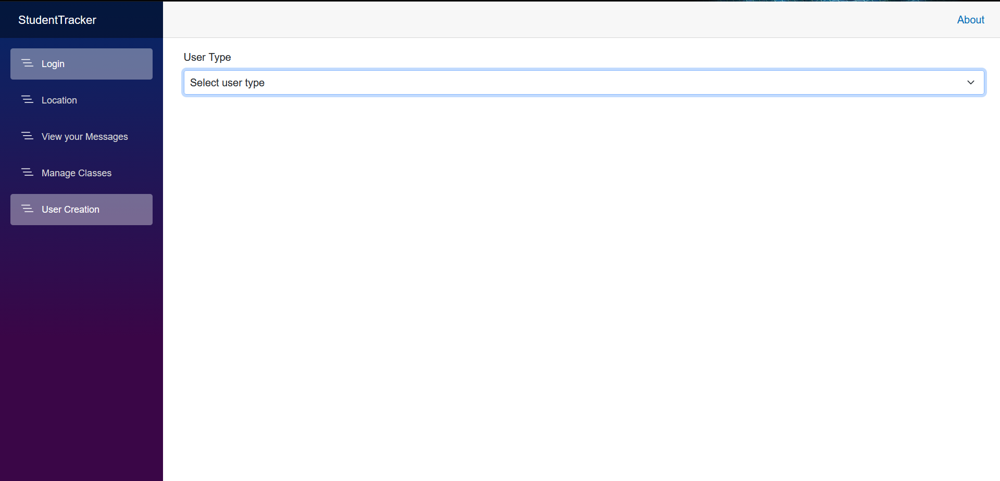
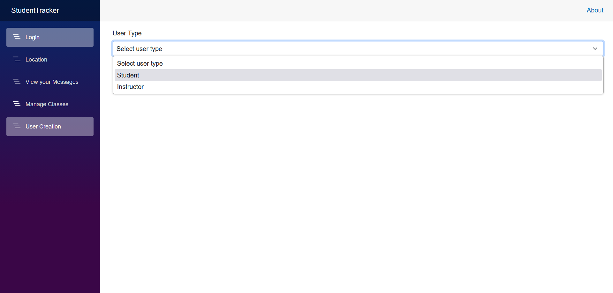
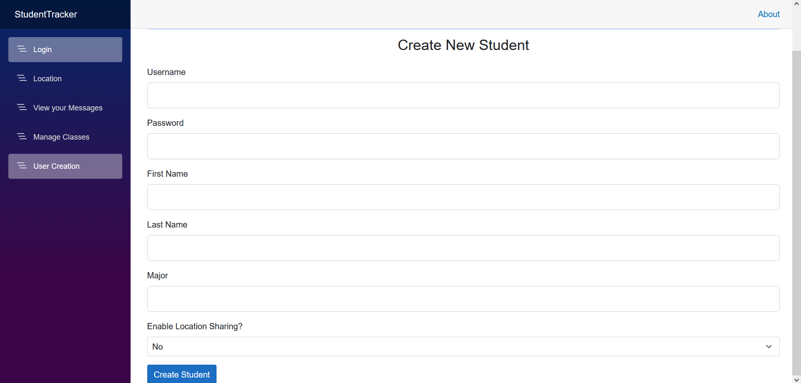
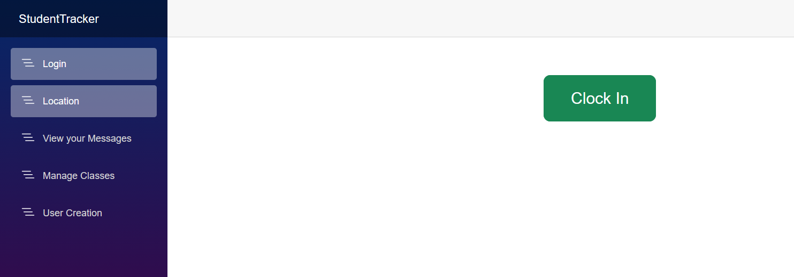

# User Notes
	- When you first load the application, create an account OR use either of these sample logins below: 
		- Username + Password 'one' or 'two' for sample student accounts (also has a sample message between the two)
    - To create an account, go to the 'User Creation' tab, select your user type (instructor or student), and populate the fields. Then, once finished, click on the 'Create Student / Instructor' button at the bottom.

  - Once an account is created, you can log in with the username and password you've created.
    - To log your time, please navigate to the 'Location' screen and press the green 'Clock In' button.
    - Note! You may need to press the button twice. If it doesn't show your location and the time, click the button again.  

 